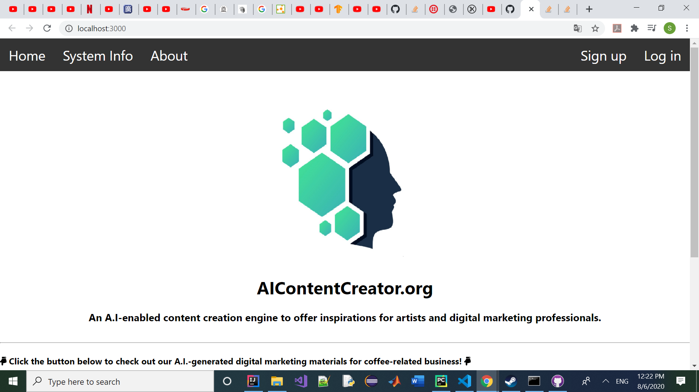

# AI_marketer_backend
 A Website for an Automated Content Creation Engine built using NodeJS together Express framework and MongoDB Atlas for creating the backend server.
 
 

The A.I.-enabled automated content creation engine used behind this website for generating the digital marketing materials was built as part of my final year project. It could first generate background visual image and slogan from two separate deep learning models, namely Deep Convolutional Adversarial Generative Network and Long-Short Term Memory (built using Tensorflow). The location of the object of interest (coffee cup for this project) from the generated image is then extracted by an object detector which is implemented using state-of-the-art computer vision techniques (YOLOv3). This position information of the object is then passed to an optimal location finder module which uses heuristics to locate a suitable coordinate on the generated image that is most optimal, at least in the sense of a human observer, for merging the generated slogan into the generated image by using some python libraries (e.g. ImageDraw).
